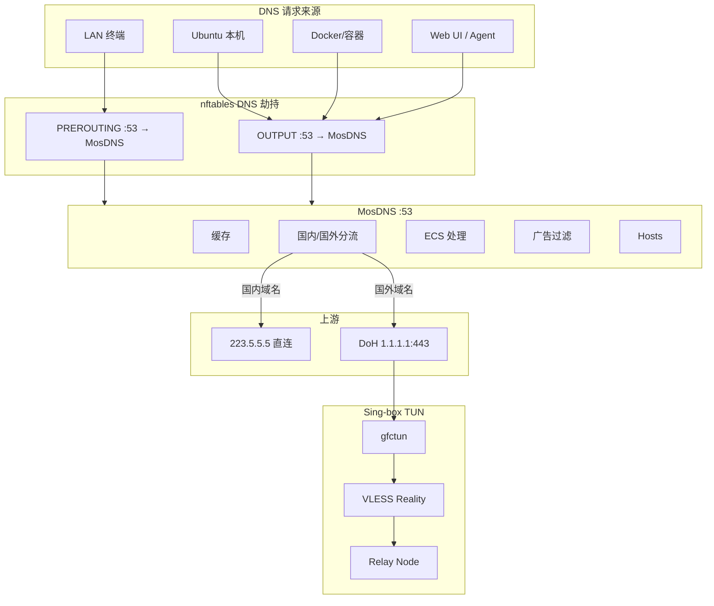
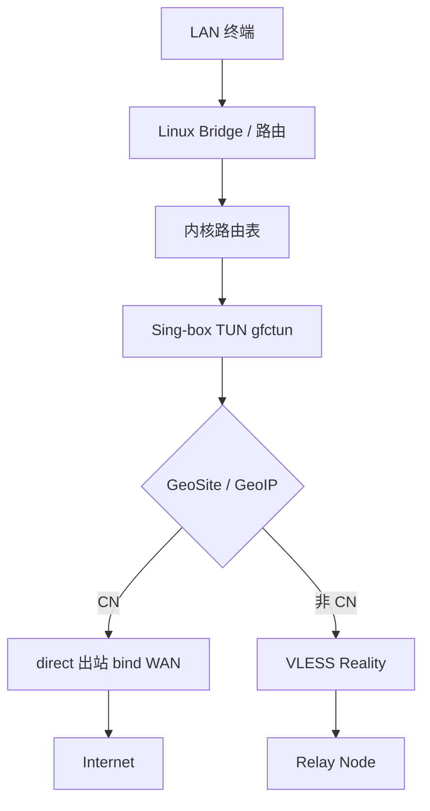
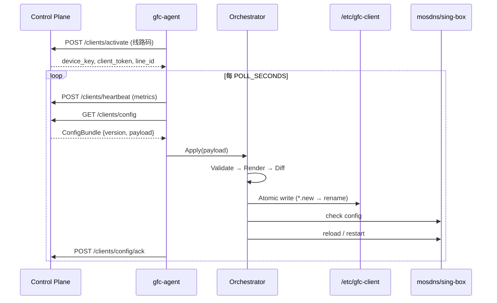

# GFC Client 企业分流盒子 — 架构设计（Phase 1）

> **版本**: v1.0-draft  
> **目标平台**: Ubuntu Server 22.04 LTS（兼容 24.04）  
> **范围**: Client Box 仅；不修改 Control Plane API  
> **状态**: 设计待确认，确认后按模块逐步实现

---

## 1. 设计目标与原则

### 1.1 产品定位

GFC Client 是企业级 Linux 网关分流盒子，运行于 Ubuntu Server，面向跨境办公、直播、电商、ERP、AI/SaaS 等场景。它不是 OpenWrt 固件，也不是 Passwall 插件栈，而是**原生 Linux 网络栈 + 模块化数据面**。

### 1.2 核心原则

| 原则 | 说明 |
|------|------|
| 职责单一 (SRP) | dnsmasq 仅 DHCP；MosDNS 仅 DNS；Sing-box 仅流量转发；Go Agent 仅管控 |
| 模块解耦 | 各组件可独立升级、重启、替换；禁止跨模块承担对方职责 |
| 配置编排 | 控制平台下发**业务配置**，Agent 本地模板渲染最终配置文件 |
| 企业级稳定 | systemd 管理、固定启动顺序、热重载、异常恢复、可回滚 |
| API 兼容 | 严格兼容现有 Control Plane `/clients/*` 接口，不修改服务端 |

### 1.3 与现有实现的关系

仓库 `gfc-client/` 已有 Go Agent、Vue3 Web、MosDNS/Sing-box 渲染器及部署脚本。本设计在需求规范基础上**统一命名、补齐缺口、明确演进路径**，而非推倒重来。

**当前实现与目标的主要差距**（实现阶段处理）：

| 项 | 当前 | 目标 |
|----|------|------|
| MosDNS 监听 | `:5335` + nft redirect | `0.0.0.0:53` 直接监听 |
| DNS 劫持范围 | 仅 LAN PREROUTING | PREROUTING（LAN）+ OUTPUT（本机/Docker） |
| systemd-resolved | 未显式禁用 | 安装时禁用，resolv.conf → 127.0.0.1 |
| 网络初始化服务 | `apply-network.sh` 散落调用 | 独立 `gfc-network.service` |
| 服务命名 | `gfc-client-*` | 规范化为 `gfc-*`（可保留别名兼容） |
| dnsmasq | 含 `cache-size` | `port=0`，禁止 DNS 能力 |
| Sing-box DNS | idle 配置含 local DNS | 禁止 DNS 出站参与解析 |
| 配置编排 | `dataplane.Engine` 雏形 | 完整 Orchestrator + 校验 + 回滚 |

---

## 2. 系统总体架构

### 2.1 三层拓扑

```
┌─────────────────────────────────────────────────────────────┐
│                    Control Plane (Python)                    │
│  线路码 / 激活 / 心跳 / 业务配置 Bundle / SSH 反向端口分配    │
└────────────────────────────┬────────────────────────────────┘
                             │ HTTPS (业务配置 JSON)
                             ▼
┌─────────────────────────────────────────────────────────────┐
│                      Relay Node (Python)                     │
│              VLESS Reality + Vision 入站 / 转发                 │
└────────────────────────────┬────────────────────────────────┘
                             │ VLESS Reality
                             ▼
┌─────────────────────────────────────────────────────────────┐
│                   Client Box (本设计范围)                     │
│  ┌─────────┐ ┌─────────┐ ┌──────────┐ ┌─────────┐ ┌───────┐ │
│  │ dnsmasq │ │ MosDNS  │ │ Sing-box │ │ Go Agent│ │ Web UI│ │
│  │ DHCP    │ │ DNS:53  │ │ TUN      │ │ 管控    │ │ :80   │ │
│  └─────────┘ └─────────┘ └──────────┘ └─────────┘ └───────┘ │
│         Linux Bridge / netplan / nftables / systemd          │
└─────────────────────────────────────────────────────────────┘
```

### 2.2 Client Box 逻辑分层

```
┌──────────────────────────────────────────────────────────────┐
│  Management Plane（管控面）                                    │
│  gfc-agent · gfc-web (gfc-api) · SQLite 状态 · 日志采集        │
├──────────────────────────────────────────────────────────────┤
│  Configuration Plane（配置编排层）★ 核心新增抽象                 │
│  Orchestrator → Templates → Validators → Atomic Apply/Rollback │
├──────────────────────────────────────────────────────────────┤
│  Data Plane（数据面）                                          │
│  MosDNS (:53) · Sing-box TUN (gfctun) · 规则集 .srs           │
├──────────────────────────────────────────────────────────────┤
│  Network Plane（网络面）                                       │
│  netplan · bridge · nftables · sysctl · dnsmasq (DHCP only)  │
└──────────────────────────────────────────────────────────────┘
```

### 2.3 部署模式

| 模式 | 说明 | 网络特征 |
|------|------|----------|
| **gateway**（默认） | 盒子作默认网关，LAN 流量经 TUN | bridge/direct + MASQUERADE + TUN auto_route |
| **bypass** | 旁路，指定设备网关指向盒子 | 仅处理指向盒子的流量；DHCP 可选关闭 |
| **transparent** | 透明接入（上游交换机镜像/串联） | 与 gateway 类似，WAN 检测策略不同 |

`proxyMode` 由控制平台 `build_client_payload()` 下发，Agent 写入 `gfc.env` 并影响 Sing-box 路由模板。

---

## 3. 模块设计

### 3.1 模块职责矩阵

| 模块 | 负责 | 禁止 |
|------|------|------|
| **dnsmasq** | DHCP、网关/DNS 地址下发、PXE 预留 | DNS 解析、缓存、转发、hosts |
| **MosDNS** | 唯一 DNS Server；缓存；国内外分流；ECS；hosts；广告过滤；DoH；DNS 日志 | 代理、路由、GeoIP |
| **Sing-box** | TUN；GeoIP/GeoSite；Reality/Vision；路由策略；出站 | DNS 缓存、DNS 分流、hosts |
| **nftables** | INPUT/FORWARD/POSTROUTING/PREROUTING/OUTPUT 防火墙与 DNS 劫持 | 复杂 mark 策略路由（交给 Sing-box） |
| **gfc-network** | sysctl、IPv4 forward、bridge、WAN 检测、nft 加载 | 业务配置 |
| **gfc-agent** | 注册、拉配置、编排渲染、热重载、心跳、状态、SSH 反向、升级 | 处理网络数据包 |
| **gfc-web** | REST API + Vue3 管理界面 | 直接写 sing-box/mosdns 配置 |

### 3.2 dnsmasq

**配置文件**: `/etc/dnsmasq.d/gfc-client.conf`（由 `gfc-network` / Agent 生成）

```ini
interface=<LAN>
bind-interfaces
except-interface=lo
listen-address=<LAN_IP>
port=0                          # 禁止 DNS
dhcp-range=<start>,<end>,<mask>,12h
dhcp-option=option:router,<LAN_IP>
dhcp-option=option:dns-server,<LAN_IP>   # 指向盒子，实际由 MosDNS 响应
```

**systemd**: 使用发行版 `dnsmasq.service`，`After=gfc-network.service`。

### 3.3 MosDNS

**监听**: `0.0.0.0:53`（UDP/TCP）

**配置树**:

```
/etc/gfc-client/mosdns/
├── mosdns.yaml              # 主配置（Orchestrator 输出）
└── easymosdns/              # 规则与列表（可选 easymosdns 结构）
    ├── config.yaml
    ├── hosts.txt
    ├── ecs_*.txt
    └── rules/*.txt
```

**上游策略**（MosDNS 无代理感知）:

| 域名类型 | 上游 | 出站路径 |
|----------|------|----------|
| 国内 | `223.5.5.5` UDP/TCP | 内核直连 |
| 国外 | DoH → `https://1.1.1.1/dns-query` | TCP 443 → Sing-box TUN 自动代理 |

**热重载**: `mosdns reload` 或 `systemctl reload gfc-mosdns`（视二进制能力，失败则 restart）。

### 3.4 Sing-box

**模式**: TUN only（`gfctun`），禁止 TPROXY / REDIR。

**配置**: `/etc/gfc-client/sing-box.json`

**关键参数**:

```json
{
  "inbounds": [{
    "type": "tun",
    "tag": "tun-in",
    "interface_name": "gfctun",
    "auto_route": true,
    "strict_route": true,
    "stack": "mixed"
  }],
  "route": {
    "rule_set": ["geosite-cn", "geoip-cn", "..."],
    "final": "proxy"
  }
}
```

**路由逻辑**:

- `geosite-cn` / `geoip-cn` → `direct`（bind WAN 接口）
- 其余 → `vless` Reality → Relay Node
- 对 MosDNS DoH 目标 `1.1.1.1:443` 走代理（通过 GeoIP 非 CN 或 domain 规则）

**DNS 块**: 生产配置中**不包含**有效 DNS server（或仅 stub 满足 check 要求），解析职责完全在 MosDNS。

### 3.5 nftables

**配置文件**:

| 文件 | 用途 |
|------|------|
| `/etc/gfc-client/nftables.conf` | 主规则（INPUT/FORWARD/POSTROUTING） |
| `/etc/gfc-client/nftables-dns.conf` | DNS 劫持（PREROUTING + OUTPUT） |

**表结构**:

```
table inet gfc_filter     # INPUT + FORWARD
table ip   gfc_nat         # POSTROUTING MASQUERADE
table inet gfc_dns_hijack  # PREROUTING + OUTPUT DNS redirect
```

### 3.6 Go Agent (gfc-agent)

见 [第 8 节 Go Agent 架构设计](#8-go-agent-架构设计)。

### 3.7 Web UI (gfc-web / gfc-api)

- 静态资源: `/opt/gfc-client/web/`
- API: `http://<LAN>:8080/api/v1/*`
- 刷码页: `http://<LAN>/`（**80** 端口，独立 listener，仅刷码）
- 只读展示 + 有限本地操作（DNS 列表、规则更新、服务重启）；**不绕过 Orchestrator 写配置**

---

## 4. 数据流设计

### 4.1 DNS 数据流



**要点**:

1. MosDNS 永远不知道代理存在；它只向 `1.1.1.1:443` 发起 DoH。
2. Sing-box 通过 TUN `auto_route` 捕获该 TCP 443 流量。
3. `systemd-resolved`、`dnsmasq DNS`、`Sing-box DNS` 均不参与解析。

### 4.2 TCP/UDP 数据流



**禁止**: iptables/nftables mark 做复杂策略路由；依赖 Sing-box `auto_route` + `strict_route`。

### 4.3 管控数据流



### 4.4 Control Plane 业务 Payload（已存在，不修改 API）

`build_client_payload()` 当前结构（Agent 输入）:

```json
{
  "deviceId": 1,
  "deviceName": "gfc-box-001",
  "lineId": 10,
  "tid": "L-XXXX",
  "proxyMode": "gateway",
  "node": { "id": 1, "name": "...", "address": "x.x.x.x", "port": 443 },
  "vless": {
    "uuid": "...",
    "flow": "xtls-rprx-vision",
    "serverName": "www.microsoft.com",
    "publicKey": "...",
    "shortId": "..."
  },
  "outbound": { "mode": "direct" },
  "bandwidthMbps": 100,
  "dns": { "intlServer": "1.1.1.1", "domesticServer": "223.5.5.5" }
}
```

Orchestrator 将此 **业务 JSON** 映射为各组件最终配置，不期望控制平台下发 `sing-box.json` 全文。

---

## 5. 配置文件结构设计

### 5.1 目录布局

```
/opt/gfc-client/                    # 程序、静态 Web、share 模板
├── bin/                            # 可选：打包二进制
├── web/                            # Vue3 构建产物
└── share/
    ├── templates/                  # Orchestrator 内置模板
    │   ├── sing-box.json.tmpl
    │   ├── mosdns.yaml.tmpl
    │   └── nftables-dns.conf.tmpl
    ├── easymosdns/                 # MosDNS 默认规则包
    └── rules/                      # geosite/geoip .srs

/etc/gfc-client/                    # 运行时配置（Agent 生成为主）
├── agent.yaml                      # Agent 自身配置
├── gfc.env                         # 环境变量（安装时种子）
├── sing-box.json                   # Sing-box 最终配置
├── mosdns.yaml                     # MosDNS 主配置（或 easymosdns/config.yaml）
├── dnsmasq.conf                    # → 链接到 /etc/dnsmasq.d/gfc-client.conf
├── nftables.conf                   # 防火墙主规则
├── nftables-dns.conf               # DNS 劫持
├── network-bridge.json             # WAN/LAN/bridge 拓扑
├── network-roles.json              # 运行时网络角色快照
├── routing-mode.json               # split / global / direct
├── policy/selector.json            # 出站策略选择
├── activation.b32                  # 线路码
├── platform.b32                    # 平台码（可选）
└── dataplane-mode.json             # idle | active

/var/lib/gfc-client/
├── gfc-client.db                   # SQLite（节点、设备、本地策略）
├── state/
│   ├── client_state.json           # token、applied_version
│   └── config_bundle.json          # 最近业务 payload 副本
├── rules/                          # geosite-cn.srs, geoip-cn.srs, ...
├── dns-lists/                      # 用户可编辑 DNS 列表
└── backups/                        # 配置回滚快照
    └── <version>-<ts>/

/var/log/gfc-client/
├── gfc-agent.log
├── gfc-api.log
├── mosdns.log
├── sing-box.log
├── gfc-network.log
└── orchestrator.log
```

### 5.2 agent.yaml 结构（草案）

```yaml
device:
  name: gfc-box-001
  proxy_mode: gateway          # gateway | bypass | transparent

control_plane:
  poll_seconds: 10
  servers: []                  # 由线路码覆盖

orchestrator:
  template_version: "1.0"
  validate_before_apply: true
  backup_generations: 5
  reload_strategy:
    mosdns: reload-or-restart
    singbox: reload-or-restart

paths:                         # 可覆盖默认路径
  etc: /etc/gfc-client
  lib: /var/lib/gfc-client
  log: /var/log/gfc-client

web:
  admin_port: 8080
  flash_port: 80
  admin_token: ""              # 空则仅 LAN 免鉴权

network:
  lan_address: 192.168.68.1
  lan_cidr: 192.168.68.0/24
  dhcp_start: 192.168.68.100
  dhcp_end: 192.168.68.250
  bridge_name: bridge_lan
```

### 5.3 Orchestrator 输出契约

每个渲染器实现统一接口:

```go
type ComponentRenderer interface {
    Name() string
    Render(ctx RenderContext, payload BusinessPayload) ([]byte, error)
    Validate(path string) error
    Reload() error
}
```

`RenderContext` 包含: 路径、WAN/LAN 接口、规则集路径、模板版本、本地覆盖项。

---

## 6. systemd 服务设计

### 6.1 启动顺序（目标态）

```
network-online.target
        │
        ▼
gfc-network.service          # sysctl, forward, nft, bridge, resolved 处理
        │
        ▼
dnsmasq.service              # 仅 DHCP
        │
        ▼
gfc-mosdns.service           # DNS :53
        │
        ▼
gfc-sing-box.service         # TUN
        │
        ▼
gfc-agent.service            # 激活、拉配置、编排、心跳
        │
        ▼
gfc-web.service              # API + Web UI
```

### 6.2 单元定义要点

#### gfc-network.service

```ini
[Unit]
Description=GFC Client Network Bootstrap
After=network-online.target systemd-networkd.service
Wants=network-online.target
Before=dnsmasq.service gfc-mosdns.service

[Service]
Type=oneshot
RemainAfterExit=yes
EnvironmentFile=/etc/gfc-client/gfc.env
ExecStart=/opt/gfc-client/deploy/gfc-network.sh start
ExecStop=/opt/gfc-client/deploy/gfc-network.sh stop

[Install]
WantedBy=multi-user.target
```

`gfc-network.sh start` 职责:

1. `systemctl disable --now systemd-resolved`
2. 写入 `/etc/resolv.conf` → `nameserver 127.0.0.1`
3. `sysctl net.ipv4.ip_forward=1` 等
4. `netplan apply` / bridge 初始化
5. 生成并加载 `nftables.conf` + `nftables-dns.conf`
6. WAN 链路检测，写入 `network-roles.json`

#### gfc-mosdns.service

```ini
[Unit]
Description=GFC MosDNS (sole DNS server)
After=gfc-network.service
Requires=gfc-network.service
Before=gfc-sing-box.service

[Service]
AmbientCapabilities=CAP_NET_BIND_SERVICE
ExecStart=/usr/local/bin/mosdns start -c /etc/gfc-client/mosdns/easymosdns/config.yaml
ExecReload=/bin/kill -HUP $MAINPID
```

#### gfc-sing-box.service

```ini
[Unit]
Description=GFC Sing-box TUN
After=gfc-mosdns.service
Requires=gfc-mosdns.service
Before=gfc-agent.service

[Service]
AmbientCapabilities=CAP_NET_ADMIN CAP_NET_BIND_SERVICE
ExecStart=/usr/local/bin/sing-box run -c /etc/gfc-client/sing-box.json
ExecReload=/bin/kill -HUP $MAINPID
```

#### gfc-agent.service

```ini
[Unit]
Description=GFC Client Agent
After=gfc-sing-box.service network-online.target
Wants=network-online.target

[Service]
ExecStart=/usr/local/bin/gfc-agent
# 首次启动可先 BootstrapIdle，有线路码后走 Orchestrator
```

#### gfc-web.service

```ini
[Unit]
Description=GFC Client Web UI
After=gfc-agent.service

[Service]
Environment=GFC_WEB_MODE=both
ExecStart=/usr/local/bin/gfc-api
```

### 6.3 与当前单元名映射

| 目标名 | 当前名 | 策略 |
|--------|--------|------|
| gfc-agent | gfc-client-agent | 重命名 + 别名 symlink |
| gfc-web | gfc-client-api | 重命名 |
| gfc-mosdns | gfc-mosdns | 保持 |
| gfc-sing-box | gfc-client-sing-box | 重命名 |
| gfc-network | （无） | 新增 |

---

## 7. nftables 规则设计

### 7.1 INPUT 链（`gfc_filter` / `inet`）

**策略**: 默认 `drop`，显式放行。

| 条件 | 动作 |
|------|------|
| `ct state established,related` | accept |
| `iif lo` | accept |
| `iif <LAN> tcp dport { 80, 443, 8080 }` | accept |
| `tcp dport { 22, 212 }` (GFC_SSH_PORT + 22 for fresh install) | accept on all ifaces |
| `iif <LAN> udp dport { 53, 67, 68 }` | accept |
| `iif <LAN> tcp dport 53` | accept |
| `iif <LAN> icmp type echo-request` | accept |

SSH 可按企业需求限制源 IP 段（后续 Web 配置）。

### 7.2 FORWARD 链

```
iif <LAN> oif <WAN> accept
iif <WAN> oif <LAN> ct state established,related accept
policy drop
```

### 7.3 POSTROUTING（`gfc_nat` / `ip`）

```
oif <WAN> masquerade
```

### 7.4 PREROUTING — DNS 劫持（`gfc_dns_hijack`）

**目的**: 防止 LAN 客户端使用 `8.8.8.8` / `114.114.114.114` 绕过 MosDNS。

```
table inet gfc_dns_hijack {
  chain prerouting {
    type nat hook prerouting priority dstnat; policy accept;
    # 来自 LAN 侧接口的所有 DNS
    iif { <LAN>, <bridge_members>... } udp dport 53 redirect to :53
    iif { <LAN>, ... } tcp dport 53 redirect to :53
  }
}
```

> 目标端口为 MosDNS 监听端口 `53`（非当前实现的 `5335`）。

### 7.5 OUTPUT — 本机 DNS 劫持（关键）

**原因**: OUTPUT 不经过 PREROUTING；Ubuntu 本机、`apt`、`curl`、Docker 默认走 OUTPUT。

```
  chain output_dns {
    type nat hook output priority -100; policy accept;
    meta skuid != 65353 ip daddr != 127.0.0.1 udp dport 53 redirect to :53
    meta skuid != 65353 ip daddr != 127.0.0.1 tcp dport 53 redirect to :53
  }
```

**说明**:

- MosDNS 进程（固定系统用户 `mosdns`，**UID 65353**）发出的 :53 查询不劫持，国内上游直连；国际解析走 DoH:443，由 sing-box TUN 代理，不经 :53 劫持。
- 安装脚本 `useradd -r -u 65353` 保证换机/重装后 nft 规则常量不变，无需运行时查 UID。
- 国际 DNS 不经 OUTPUT :53 规则，无需在 nft 层区分国内/国际。

**配合**: `/etc/resolv.conf` 固定 `nameserver 127.0.0.1`，双保险。

### 7.6 规则加载顺序

`gfc-network.sh` 执行:

```bash
nft -f /etc/gfc-client/nftables.conf
nft -f /etc/gfc-client/nftables-dns.conf
```

升级/重装前先 `nft delete table` 幂等清理（现有 `singbox-nft-cleanup.sh` 可合并）。

---

## 8. Go Agent 架构设计

### 8.1 进程结构

```
gfc-agent
├── main
└── internal/
    ├── agent/           # Runner 主循环（已有）
    ├── activation/      # 线路码读写（已有）
    ├── controlplane/    # CP API 客户端（已有）
    ├── orchestrator/    # ★ 配置编排层（从 dataplane 演进）
    │   ├── orchestrator.go
    │   ├── pipeline.go      # Validate → Render → Apply → Rollback
    │   └── snapshot.go      # 版本快照
    ├── render/
    │   ├── singbox/     # 模板渲染（已有）
    │   ├── mosdns/      # 模板渲染（已有）
    │   ├── dnsmasq/     # 新增
    │   └── nftables/    # 新增
    ├── dataplane/       # 降为 Orchestrator 的薄封装 / 兼容层
    ├── network/         # 网络状态采集（已有）
    ├── metrics/         # 心跳指标（已有）
    ├── rules/           # .srs 规则管理（已有）
    ├── dnslists/        # DNS 列表（已有）
    └── upgrade/         # 自动升级（待实现）
```

### 8.2 Configuration Orchestrator（核心）

**设计模式**: SD-WAN / 企业防火墙常见的 *Intent-based Configuration*。

```
┌─────────────────────────────────────────────────────────┐
│                  Business Payload (JSON)                 │
│         来自 Control Plane，版本号 SHA256 前 16 位          │
└───────────────────────────┬─────────────────────────────┘
                            ▼
┌─────────────────────────────────────────────────────────┐
│ 1. Normalizer — 合并本地覆盖（proxyMode, routing, DNS 列表）│
└───────────────────────────┬─────────────────────────────┘
                            ▼
┌─────────────────────────────────────────────────────────┐
│ 2. Validator — 语义校验（节点地址、UUID、接口存在性）       │
└───────────────────────────┬─────────────────────────────┘
                            ▼
┌─────────────────────────────────────────────────────────┐
│ 3. Renderer Registry — 并行渲染各组件                    │
│    singbox │ mosdns │ dnsmasq │ nftables                 │
└───────────────────────────┬─────────────────────────────┘
                            ▼
┌─────────────────────────────────────────────────────────┐
│ 4. Component Check — sing-box check / mosdns -test       │
└───────────────────────────┬─────────────────────────────┘
                            ▼
┌─────────────────────────────────────────────────────────┐
│ 5. Atomic Apply — 写入 .new → rename，更新 snapshot      │
└───────────────────────────┬─────────────────────────────┘
                            ▼
┌─────────────────────────────────────────────────────────┐
│ 6. Reload Manager — 按依赖顺序热重载                     │
│    mosdns → sing-box（dnsmasq/nft 仅网络变更时）          │
└───────────────────────────┬─────────────────────────────┘
                            ▼
┌─────────────────────────────────────────────────────────┐
│ 7. Ack / Rollback — 失败则恢复上一 snapshot              │
└─────────────────────────────────────────────────────────┘
```

**收益**:

- 控制平台无需感知 Sing-box 1.8 vs 1.9 配置差异
- 升级 MosDNS/Sing-box 只更新 Agent 内模板
- 多版本盒子共存同一 Control Plane
- 配置可验证、可回滚，符合企业运维

### 8.3 Agent 主循环（Runner.tick）

与现有逻辑一致，细化如下:

| 阶段 | 行为 |
|------|------|
| 空闲 | 无线路码 → 写 status `waiting_line_code`；Orchestrator 维持 idle 数据面 |
| 激活 | `POST /clients/activate` → 持久化 `client_state.json` |
| 心跳 | 采集 CPU/内存/接口/TUN/DNS 状态 → `POST /clients/heartbeat` |
| 拉配置 | `GET /clients/config` → 比较 `version` 与 `applied_version` |
| 应用 | `Orchestrator.Apply()` → `POST /clients/config/ack` |
| 反向 SSH | 心跳响应 `reverse_ssh_port` → 本地 `autossh`（待实现） |

### 8.4 状态与存储

| 存储 | 内容 |
|------|------|
| SQLite | 节点表、DNS 列表元数据、操作审计 |
| `client_state.json` | token、applied_version |
| `config_bundle.json` | 最近 payload |
| `status.json` | Web 展示用聚合状态 |
| `backups/` | Orchestrator 世代快照 |

### 8.5 自动升级（规划）

1. Agent 心跳上报 `agent_version`
2. Control Plane 或本地 cron 检测新版本包（`/opt/gfc-client` tar）
3. 下载 → 校验签名 → 停 gfc-web → 替换二进制 → 迁移配置 → 启动
4. 失败回滚上一版本

---

## 9. Web UI 页面规划

### 9.1 信息架构

| 页面 | 路由 | 需求覆盖 | 现状 |
|------|------|----------|------|
| **概览 Dashboard** | `/` | 网络/节点/Agent 摘要 | 有，需增强 |
| **网络 Network** | `/network` | WAN/LAN/DNS/TUN 状态 | 有 |
| **节点 Nodes** | `/nodes` | 在线、延迟、当前线路 | 有 |
| **策略 Policy** | `/policy` | 出站选择、路由模式 | 有 |
| **DNS** | `/dns` | 查询日志、缓存命中、上游状态 | 部分（列表管理为主） |
| **分流规则 Rules** | `/rules` | GeoSite/GeoIP 规则集 | 有 |
| **Sing-box** | `/singbox` | 连接、流量、TUN、规则命中 | **待新增** |
| **服务 Services** | `/services` | systemd 状态、重启 | 有 |
| **日志 Logs** | `/logs` | 聚合日志 tail | 有 |
| **设置 Settings** | `/settings` | 设备名、代理模式、日志级别 | 有 |
| **刷码 Flash** | `/flash.html` (:80) | 线路码刷入 | 有 |

### 9.2 Dashboard 目标布局

```
┌─────────────────────────────────────────────────────────────┐
│ 概览                                                         │
├──────────────┬──────────────┬──────────────┬────────────────┤
│ WAN 状态     │ LAN 状态     │ DNS (MosDNS) │ TUN (gfctun)   │
├──────────────┴──────────────┴──────────────┴────────────────┤
│ 节点：在线 / 延迟 / 线路 TID / 当前出站                        │
├───────────────────────────────────────────────────────────────┤
│ Agent：注册状态 / 心跳 / 控制平台 / 线路码 / 配置版本           │
├───────────────────────────────────────────────────────────────┤
│ 系统：CPU / 内存 / 磁盘 / 运行时间                             │
└─────────────────────────────────────────────────────────────┘
```

### 9.3 API 扩展（Web 专用，不改 Control Plane）

| 端点 | 说明 |
|------|------|
| `GET /api/v1/status` | 聚合 status.json |
| `GET /api/v1/metrics` | 详细指标 |
| `GET /api/v1/dns/stats` | MosDNS 缓存命中率、上游健康 |
| `GET /api/v1/singbox/stats` | 连接数、流量、规则命中（sing-box API / clash-api） |
| `GET /api/v1/agent` | 注册、心跳、配置版本 |
| `POST /api/v1/dataplane/reload` | 触发 Orchestrator 本地重载 |

Sing-box 建议开启 `experimental.clash_api` 仅供本机 `127.0.0.1` 访问，由 gfc-api 代理。

---

## 10. systemd-resolved 处理

安装脚本 **必须** 执行:

```bash
systemctl disable --now systemd-resolved
rm -f /etc/resolv.conf
cat > /etc/resolv.conf <<EOF
nameserver 127.0.0.1
EOF
chattr +i /etc/resolv.conf   # 可选：防止被覆盖
```

若使用 `netplan` 管理 DNS，需确保不重新指向 stub resolver。

---

## 11. 实现路线图（Phase 2+）

确认本设计后，建议按以下顺序实现:

| 阶段 | 模块 | 交付物 |
|------|------|--------|
| **P2-1** | 网络基座 | `gfc-network.service`、resolved 禁用、MosDNS 改 :53、nft OUTPUT 劫持 |
| **P2-2** | Orchestrator | 从 `dataplane.Engine` 重构；快照与回滚 |
| **P2-3** | 模板完善 | sing-box 去 DNS；mosdns DoH 443；dnsmasq/nft 渲染器 |
| **P2-4** | systemd 对齐 | 依赖链、热重载、服务重命名 |
| **P2-5** | Web 增强 | Dashboard、Sing-box 页、DNS 统计 API |
| **P2-6** | 运维 | 反向 SSH、自动升级、旁路/透明模式细化 |
| **P2-7** | 测试 | 安装验证脚本、DNS 劫持用例、断线恢复 |

---

## 12. 验收标准（设计级）

1. LAN 客户端仅 DHCP 从 dnsmasq 获取地址，DNS 查询全部进入 MosDNS
2. 本机 `dig @8.8.8.8` 仍被劫持至 MosDNS
3. Docker 容器内 DNS 请求进入 MosDNS
4. 国外域名 DoH 经 Sing-box 代理，MosDNS 配置无 proxy 字段
5. TCP 流量经 TUN 分流，国内直连、国外 Reality
6. `systemctl stop systemd-resolved` 且不存在 127.0.0.53 stub
7. 控制平台 payload 变更后 Agent 自动渲染、校验、热重载并 ack
8. 配置 apply 失败可回滚至上一可用快照
9. 启动顺序符合第 6 节依赖图
10. 不修改 Control Plane API 即可完成端到端激活

---

## 附录 A：组件版本建议

| 组件 | 建议版本 | 备注 |
|------|----------|------|
| sing-box | ≥ 1.9.x | TUN、Reality、Vision、rule-set |
| mosdns | ≥ 5.x | 插件化、DoH 上游 |
| dnsmasq | Ubuntu 22.04 自带 | 仅 DHCP |
| Go | ≥ 1.22 | Agent + API |
| Vue | 3.x | Web UI |

---

## 附录 B：术语表

| 术语 | 含义 |
|------|------|
| 线路码 | Base32 编码 JSON，含控制平台 URL 与 lineId |
| 业务配置 | Control Plane `build_client_payload()` 输出 |
| 配置编排 | Agent 将业务配置渲染为各组件最终文件的过程 |
| 数据面 | MosDNS + Sing-box 实际处理流量的层 |
| 管控面 | Agent + Web + Control Plane 交互 |

---

*文档结束。请审阅并确认后进入 Phase 2 模块实现。*
